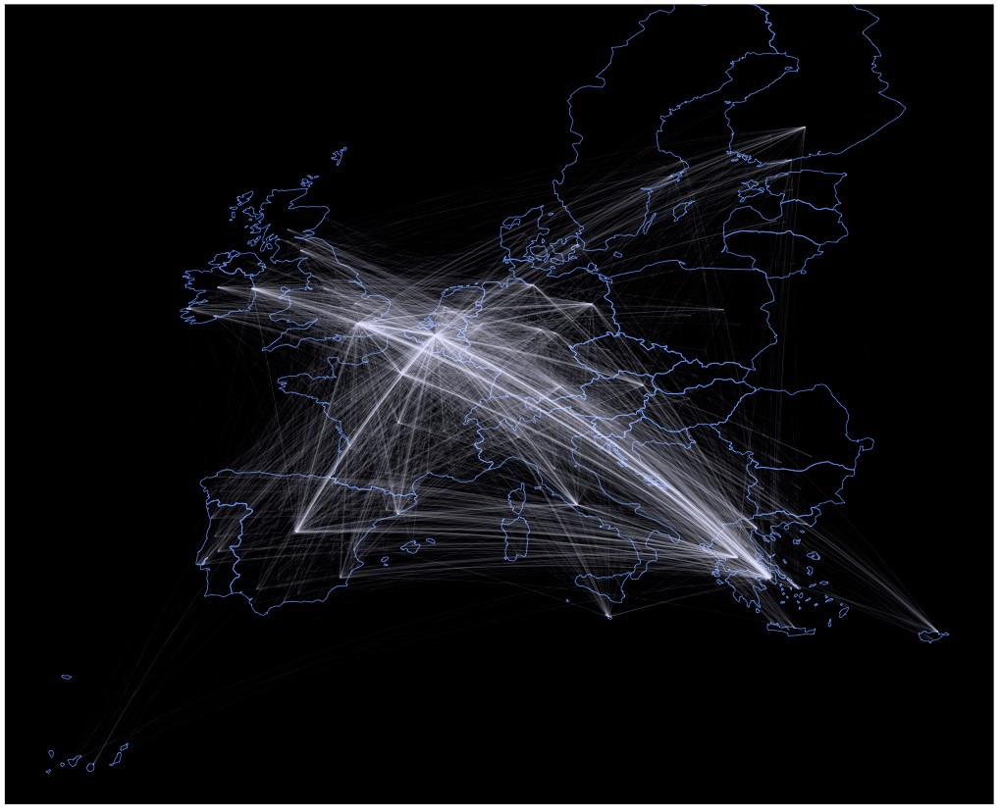
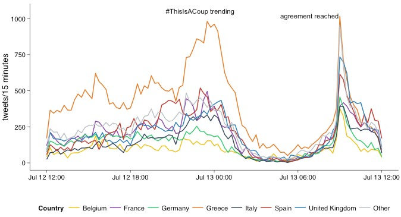
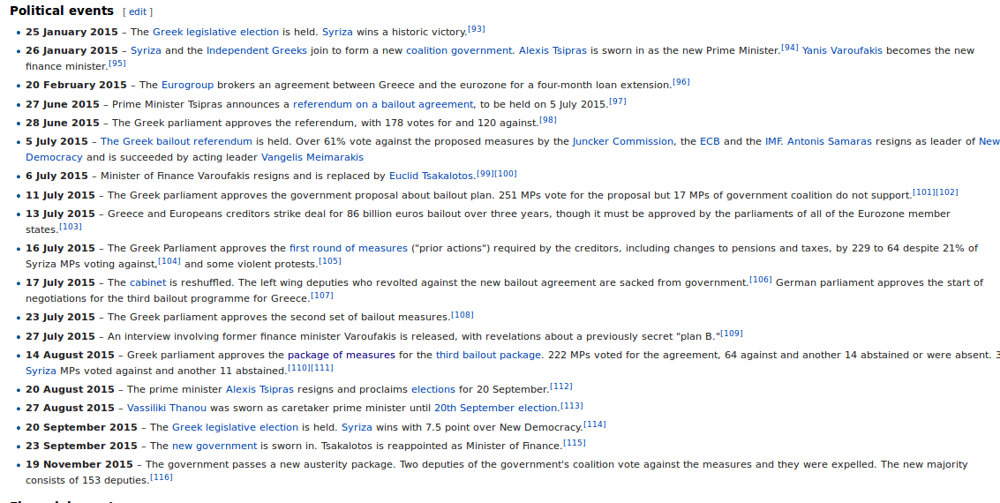

```{r echo=FALSE, warning=FALSE, message=FALSE}
load('../../data/merged_corpus_europe.rda')
pkgs <- c('twitteR', 'tm.lexicon.GeneralInquirer', 'tm.plugin.sentiment', 'dplyr', 'ggplot2', 'stringr', 'wordcloud', 'tm', 'rworldmap', 'ggmap', 'textcat', 'translateR', 'tidyr', 'lfe', 'maptools', 'rgeos', 'nlme','knitr')
repmis::LoadandCite(pkgs, file = '../../RpackageCitations3.bib')

multiplot <- function(..., plotlist=NULL, file, cols=1, layout=NULL) {
  library(grid)

  # Make a list from the ... arguments and plotlist
  plots <- c(list(...), plotlist)

  numPlots = length(plots)

  # If layout is NULL, then use 'cols' to determine layout
  if (is.null(layout)) {
    # Make the panel
    # ncol: Number of columns of plots
    # nrow: Number of rows needed, calculated from # of cols
    layout <- matrix(seq(1, cols * ceiling(numPlots/cols)),
                    ncol = cols, nrow = ceiling(numPlots/cols))
  }

 if (numPlots==1) {
    print(plots[[1]])

  } else {
    # Set up the page
    grid.newpage()
    pushViewport(viewport(layout = grid.layout(nrow(layout), ncol(layout))))

    # Make each plot, in the correct location
    for (i in 1:numPlots) {
      # Get the i,j matrix positions of the regions that contain this subplot
      matchidx <- as.data.frame(which(layout == i, arr.ind = TRUE))

      print(plots[[i]], vp = viewport(layout.pos.row = matchidx$row,
                                      layout.pos.col = matchidx$col))
    }
  }
}


```


## A European *Hyperagora*?

From an ancient marketplace in Athens...

<div align="center">

</div>


## A European *Hyperagora*?

... to a 'modern' supermarket.

<div align="center">

</div>


## A European *Hyperagora* - The Emergence of a European Public Sphere

* Is the European Union a marketplace of ideas as well as only a marketplace? 
* Is there something like a European public debate?
* Are political dialogs supranationalized?

## Our Project

### Case Selection: **Greek Bailouts** 
- widely discussed case
- relevant to the whole of Europe

### Data Selection: **Twitter Data**
- interesting webscraping experience
- open platform: anyone in Europe can contribute to it

**Without further work on how twitter reflects wider society, to what extent can we extrapolate our results to the "European Public Sphere"?**

## Research Question

What can twitter tell us about pan-European reactions to the European governance of the public-debt crisis in Greece? 
 
* What can variation across time and space in the volume of Tweets regarding the euro crisis tell us about popular engagement with the issues?

* What can the content of Tweets related to the crisis tell us about the spread of public opinion on the handling of the crisis in Greece between and within countries?

## Previous Research

LSE project on how Europeans interact through Twitter...

<div align="center">

<br>
<span style="font-size=30%">Source: <a href="bit.ly/1LLTdOM">bit.ly/1LLTdOM</a>
</div>

## Previous Research

... looking at #ThisIsACoup trending and reactions to anouncement that agreement has been reached.

<div align="center">

<br>
<span style="font-size=30%">Source: <a href="bit.ly/1LLTdOM">bit.ly/1LLTdOM</a>
</div>


## Data Gathering 

we pulled together a corpus of tweets 

- gathered by specifying search terms & time periods (using modified GetOldTweets)
- adding information about the users who posted the tweets (using twitteR)
- adding locations given by those users (using maqQuest and Google)
- identifying language of every tweet (using textCat)
- translating non-English tweets into English (using translateR)

## Data Gathering 

```{r echo=FALSE, warning=FALSE, message=FALSE, cache=TRUE}
minicorpus <- merged_corpus_europe[sample(nrow(merged_corpus_europe), 200), ]

text_corpus <- Corpus(VectorSource(minicorpus$text))

#clean up
text_corpus <- tm_map(text_corpus,
                              content_transformer(function(x) iconv(x, to='UTF-8', sub='byte')),
                              mc.cores=1
)
text_corpus <- tm_map(text_corpus, content_transformer(tolower), mc.cores=1)
text_corpus <- tm_map(text_corpus, removePunctuation, mc.cores=1)
text_corpus <- tm_map(text_corpus, function(x)removeWords(x,stopwords()), mc.cores=1)
wordcloud(text_corpus)
```

## Data Analysis

What can twitter tell us about pan-European reactions to the European governance of the public-debt crisis in Greece? 
 
- What can **variation across time and space** in the volume of Tweets regarding the euro crisis tell us about **popular engagement** with the issues? 

*Descriptive Statistics*

- What can the **content of Tweets** related to the crisis tell us about the **spread of public opinion** on the handling of the crisis in Greece between and within countries? 

*Sentiment Analysis*

## Main findings: Variation Across Space

```{r cache=TRUE, warning=FALSE, echo=FALSE, fig.width=6, fig.align="center"}

by_country <- merged_corpus_europe %>%
  group_by(approx_country) %>%
  summarise(
    n = length(approx_country)
  ) %>%
  filter(n > 1000)

ggplot(
  by_country,
  aes(approx_country,n)) + 
  geom_bar(stat="identity") +
  theme_bw() +
  ylab('n of Tweets') +
  xlab('Countries')


```

## Main findings: Variation Across Time

```{r cache=TRUE, warning=FALSE, echo=FALSE, fig.width=6, fig.align="center"}

by_period <- merged_corpus_europe %>%
  group_by(period) %>%
  summarise(
    n = length(period)
  )

ggplot(
  by_period,
  aes(period,n)) + 
  geom_bar(stat="identity") +
  theme_bw() +
  ylab('n of Tweets') +
  xlab('Period')


```

## Main findings: Variation Across Space and Time

```{r cache=TRUE, warning=FALSE, echo=FALSE, fig.width=6, fig.align="center"}

by_period_country <- merged_corpus_europe %>%
  group_by(period, approx_country) %>%
  summarise(
    n = length(period)
  ) %>%
  filter(n > 1000)

ggplot(
  by_period_country, 
  aes(approx_country,n, fill=period)) + 
  geom_bar(stat="identity") +
  theme_bw() +
  ylab('n of Tweets') +
  xlab('Period')


```

## Main findings: Sentiment Analysis


- Do we find differences in sentiment and the variance of between countries in different periods?


```{r echo=FALSE, message=FALSE, warning=FALSE}

greek_greece_debt <- merged_corpus_europe %>%
  filter(query %in% c("greek+debt","greece+debt")) %>%
  mutate(query="greek_greece_debt") 

greek_greece_debt <- greek_greece_debt[!duplicated(greek_greece_debt$tweet_id),]

merged_corpus_europe <- rbind(merged_corpus_europe,greek_greece_debt)

merged_corpus_europe$day <- as.Date(substr(as.character(merged_corpus_europe$date),1,10))

by_country_by_year_by_query <- merged_corpus_europe %>%
  group_by(approx_country,period,query) %>%
  summarise(
    sentiment = mean(stotal,na.rm=TRUE),
    sentiment_variance = var(stotal,na.rm=TRUE),
    tweet_count = length(stotal)
  ) %>%
  mutate(query = gsub("\\+","_",query))

by_country_by_year <- by_country_by_year_by_query %>%
  select(-sentiment_variance,-tweet_count) %>%
  spread(query,sentiment)

by_country_by_year_var <- by_country_by_year_by_query %>%
  select(-sentiment,-tweet_count) %>%
  spread(query,sentiment_variance)

by_country_by_year_count <- by_country_by_year_by_query %>%
  select(-sentiment_variance,-sentiment) %>%
  spread(query,tweet_count)

countries <- readShapeSpatial("../../data/geographic_data/CNTR_2014_60M_SH/Data/CNTR_RG_60M_2014.shp")

countries.points <- fortify(countries)
countries.points <- left_join(
  countries.points,
  data.frame(
    id = unique(countries.points$id),
    CNTR_ID = unique(countries@data$CNTR_ID)
  )
)
countries.df <- countries.points %>%
  left_join(countries@data,by="CNTR_ID")

countries.df$CNTR_ID <- as.character(countries.df$CNTR_ID)

countries.df[countries.df$CNTR_ID=="UK","CNTR_ID"] <- "GB"
countries.df[countries.df$CNTR_ID=="EL","CNTR_ID"] <- "GR"

countries.variance <- countries.df %>%
  left_join(
    rename(
      by_country_by_year_var,
      CNTR_ID = approx_country
      )
  ) 

countries.df <- countries.df %>%
  left_join(
    rename(
      by_country_by_year,
      CNTR_ID = approx_country
      )
  ) 

sentiment_map <- function(df,p,q,v=FALSE) {
    if(v==FALSE){
      cscale <- scale_fill_gradientn(colours=c("red","white","green"),limits=c(-2,2),na.value="grey")
      label <- "Sentiment"
    } else {
      cscale <- scale_fill_gradientn(colours=c("white","green"),limits=c(0,4),na.value="grey")
      label <- "Sentiment \nVariance"
    }
  ggplot(filter(df,period==p))+
  aes_string("long","lat",group="group",fill=q) +
  cscale +
  geom_polygon() +
  geom_path(color="grey",size=0.1) +
  #theme_bw() +
  #theme_nothing() +
  theme(
    panel.background = element_rect(fill="#84C9F8"),
    axis.text = element_blank(),
    line = element_blank(),
    axis.text = element_blank()
  ) +
  xlim(c(-12,35)) +
  ylim(c(32,72)) +
  labs(fill=label,x="",y="") + 
  coord_equal()
}


```

## Austerity+Greece 2010
```{r message=FALSE, echo=FALSE, warning=FALSE}

s <- sentiment_map(countries.df,"2010","greek_greece_debt")
v <- sentiment_map(countries.variance,"2010","greek_greece_debt",v=TRUE)
multiplot(s,v,cols=2)
#kable(select(filter(by_country_by_year_count,period=="2010"),approx_country,greek_greece_debt))


```

## Austerity+Greece 2012
```{r message=FALSE, echo=FALSE, warning=FALSE}

s <- sentiment_map(countries.df,"2012","greek_greece_debt")
v <- sentiment_map(countries.variance,"2012","greek_greece_debt",v=TRUE)
multiplot(s,v,cols=2)
#kable(select(filter(by_country_by_year_count,period=="2010"),approx_country,greek_greece_debt))

```

## Austerity+Greece 2015
```{r message=FALSE, echo=FALSE, warning=FALSE}

s <- sentiment_map(countries.df,"2015","greek_greece_debt")
v <- sentiment_map(countries.variance,"2015","greek_greece_debt",v=TRUE)
multiplot(s,v,cols=2)
#kable(select(filter(by_country_by_year_count,period=="2010"),approx_country,greek_greece_debt))

```


## Daily Sentiment Averages in Greece and Germany during 2015
```{r message=FALSE, echo=FALSE, warning=FALSE}

merged_corpus_daily <- merged_corpus_europe %>%
  group_by(day,period,approx_country) %>%
  summarise(
    sentiment = mean(stotal,na.rm=TRUE),
    sentiment_variance = var(stotal,na.rm=TRUE),
    tweet_count = length(stotal)
  )

sentiment_time <- function(df,p,q=NULL,clist=NULL) {
  df <- filter(df,period==p)
  if(!is.null(q)) {
    df <- filter(df,query==q)
  }
  if(!is.null(clist)){
    df <- filter(df,approx_country %in% clist)
  }
  ggplot(df) + 
  geom_line(aes(day,sentiment,colour=approx_country)) +
  geom_ribbon(aes(
    day,
    ymin=sentiment-sqrt(sentiment_variance),
    ymax=sentiment+sqrt(sentiment_variance),
    fill=approx_country),alpha=0.2) +
  labs(
    x = "Time",
    y = "Sentiment"
  )
}


sentiment_time(merged_corpus_daily,"2015",clist=c("GR","DE"))

```

## Is this all due to Random Chance?
- We summarised average sentiment by country and period, and regressed the sentiment score on country and period dummies.

```{r echo=FALSE,warning=FALSE,message=FALSE, include=FALSE}

lmp <- function (modelobject) {
	if (class(modelobject) != "lm") stop("Not an object of class 'lm' ")
	f <- summary(modelobject)$fstatistic
	p <- pf(f[1],f[2],f[3],lower.tail=F)
	attributes(p) <- NULL
	return(p)
}

all_reg <- lm(sentiment~approx_country+period,data=by_country_by_year_by_query)
Fstat <- lmp(all_reg)
print(Fstat)

```

- An F-test of the joint significance of the country and time dummies was significant at the 1% significance level (p = `r round(Fstat,4)`)

## Conclusions

- What can twitter tell us about pan-European reactions to the European governance of the public-debt crisis in Greece? 
- What is the importance of reproducibility?

## Chronology 2015 

<div align="center">

</div>
