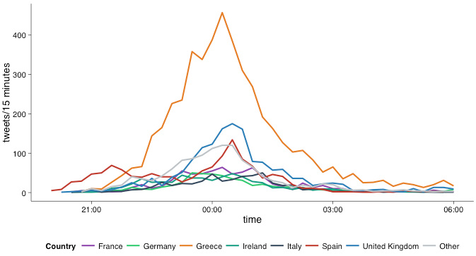

## A European *Hyperagora*?

From an ancient marketplace in Athens...

## A European *Hyperagora*?

... to a 'modern' supermarket.

## A European *Hyperagora* - The Emergence of a European Public Sphere

* Is the European Union a marketplace of ideas as well as only a marketplace? 
* Is there something like a European public debate?
* Are political dialogs supranationalized?

## Our Project

### Case Selection: **Greek Bail Outs** 
- widely discussed case
- relevant to the whole of Europe

### Data Selection: **Twitter Data**
- interesting webscraping experience
- open platform: anyone in Europe can contribute to it

## Research Question

What can twitter tell us about pan-European reactions to the European governance of the public-debt crisis in Greece? 
 
* What can variation across time and space in the volume of Tweets regarding the euro crisis tell us about popular engagement with the issues?

* What can the content of Tweets related to the crisis tell us about the spread of public opinion on the handling of the crisis in Greece between and within countries?

## Previous Research

## Previous Research

## Data Gathering 

we pulled together a corpus of tweets 

- gathered by specifying search terms & time periods (using modified GetOldTweets)
- adding information about the users who posted the tweets (using twitteR)
- adding locations given by those users (using maqQuest and Google)
- identifying language of every tweet (using textCat)
- translating non-English tweets into English (using translateR)

## Data Gathering 

WORD CLOUD

## Findings

What can twitter tell us about pan-European reactions to the European governance of the public-debt crisis in Greece? 
 
* What can variation across time and space in the volume of Tweets regarding the euro crisis tell us about popular engagement with the issues?

* What can the content of Tweets related to the crisis tell us about the spread of public opinion on the handling of the crisis in Greece between and within countries?

## Main findings: Variation Across Time

## Main findings: Variation Across Space

## Main findings: Variation Across Space and Time

## Main findings: Sentiment Analysis

## Conclusions

- 
- quantitative methos -> limited
