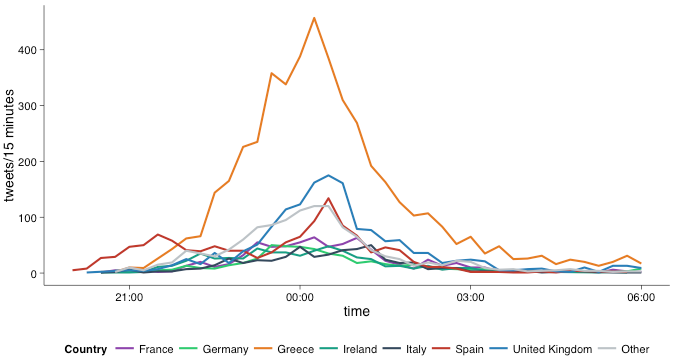

# Research Proposal for M. Callaghan and V. Nieberg

## Introduction
context eurocrisis + timeline negotiations /memorandums

## Research Question

In our research project we will investigate the following questions:

What can twitter tell us about pan-European reactions to the European governance of the public-debt crisis in Greece? 
 
* What can variation across time and space in the volume of tweets regarding the euro crisis tell us about popular engagement with the issues?

* What can the content of tweets related to the crisis tell us about the spread of public opinion on the handling of the crisis in Greece between and within countries?

By investigating European public discourse on the Euro crisis the answer to these questions could potentially add to the literature on the emergence of a European public sphere.

## Literature Review

### On Twitter Research

The body of twitter research has constantly grown over the past years [for a comprehensive analysis and typology of twitter research up to 2013, see @Zimmer2014]. Some of the findings with relevance to our research design are discussed below.

Twitter is a Source for Meaningful Information about Engagement with and Opinions about Political Topics.
Twitter is used as a platform for political deliberation. In a recent study on Tweets mentioning parties or politicians before the 2009 German federal election, Tumasjan et al. found that "Twitter is not just used to spread political opinions, but also to discuss these opinions with other users" [@tumasjan2010,183]. Furthermore, specific patterns of twitter usage have been identifed that correspond with high-profile political events. Hughes and Palen found that, compared to general Twitter usage, more broadcast-based information sharing activities happen [@Hughes2009, 259]. <!--As for a difference in between natural catastrophes and political events, they found that there was less information sharing (measured by instances of URLs) in political conventions than in natural catastrophes [@Hughes2009, 257]. -->
Moreover, Tumasjan et al. found that it was possible to extact meaningful information about political opinions from both the volumes and the content of these tweets: "the mere number of tweets reflects voter preferences and came close to traditional election polls" [@tumasjan2010, 183]. 

Twitter gives information on location of tweets and users, which must be carefully interpreted. Devin Gaffney points out methodological problems with using the given location of twitter users - "in many cases user-entered profile locations differ from the physical locations users are actually tweeting from" [@Graham2014, 1] which must be considered when interepreteing results. <!-- Further research by Gaffney has tested the degree to which geographic, semantic, and social distances impact the frequency of interactions between users [@Number2012]. -->


Though the field of Sentiment Analysis (SA) is perhaps most developed in the business world [@Zimmer2014, 250], an increasing body of literature has developed, focused on retrieving information about political opinions from the Twittersphere. Though Tumasjan's results have come under scrutiny [see @jungherr2012pirate], the authors found that "the sentiment of Twiter messages closely corresponded to political programs, candidate profiles, and evidence from the media coverage of the campaign trail" [@tumasjan2010, 183].
<!--Sentiment analysis of
tweets was also a particularly prominent analysis type, with 16 percent of studies (conducted between 2007-2012)
relying on some form of classification or analysis of affect within tweets [@Zimmer2014, 253]-->

Finally, some studies discuss ethical aspects of twitter research. For example, concerns about creating a permanent archive of tweets have been voiced. These concerns included whether "such archive was aligned with users’ privacy expectations" [@Zimmer2014, 258; @Zimmer2010]

### On Awareness and Public Opinion across Europe on the Governance of the Public-Debt Crisis in Greece

Academic research on the emergence of a European public sphere is not a recent phenomenon [@risse2003emerging, 1]. Hitherto, however, research has been characterized as rather normative, as the "research community has been [...] interested in producing policy recommendations for public sphere-building" [@Trenz2015, 234]. Recent studies, on the other hand, seem to put emphasis on an empirical grounding of the debate [@Trenz2015, @Drewski2015]. This development is being mirrored in research on the public debate across Europe on the euro crisis. It has been suggested that “there  is  an  emerging  demos  in  the European  polity  and  it  has  been  strengthened during the euro crisis” [@risse2014, 1213]. When testing this hypothesis empirically, though, by looking at newspaper editorials in Spain and Germany, Drewski found that there were significant differences  along  national  instead  of  ideological  lines  in  the discussion  of  the  Euro  crisis [@Drewski2015, 5]. <!-- Qoute from Drewski, maybe for the final paper? There is some evidence that Europeans have reacted to the crisis not by banding together,  but  by  rallying  around  national  values  and  interests.  For  example,  the  German center‐left was not ready to side with the Spanish center‐left to fight the neoliberal response to the crisis. Instead, they preferred to stick to their German compatriots from the center‐right in supporting austerity politics. This is no good news for the idealists’ vision of a European demos engendered by the Euro crisis. A post‐national European  democracy,  giving  voice  to  transnational  political  coalitions,  is  still  far from  becoming  reality -->

Max Hänska and Stefan Bauchowitz in a recent LSE blog entry track twitter activity during the negotiations leading up to the third Greek bailout agreement. [@LSEtwitter] According to their findings, tweets synchronised around key mini-events throughout the negotiations, with peaks and troughs mirrored across national twitter-spheres. These results suggest that popular engagement with the issue converges across Europe.


<!--we'd want to name the source of tables) -->

They further looked at instances of tweets containing #ThisIsACoup, representing a particular opinion on the agreement. The then showed that the spread of #ThisIsACoup was not reflected in the studied countries equally. This indicated a divergence of public opinion along national lines.


<!--we'd want to name the source of tables) -->

### On Sentiment Analysis
Grimmer describes how "automated content methods can make possible the previously impossible in political science: the systematic analysis of large-scale text collections without massive funding support" [@grimmer2013,2].

"The goal of building text models is therefore different than model building to make causal inferences" [@grimmer2013, 4].

"Emphasis in evaluations should be placed on helping researchers to assign documents into predetermined categories, discover new and useful categorizytion schemes for texts, or in measuring theoretically relevant quantities from large collections of text." [@grimmer2013, 4].

"For shorter texts, accompanying information (or an extremely large volume of texts) is often necessary for classifcation or scaling methods to perform reliably" [@grimmer2013, 6].

"We will assume documents are a *bag of words*, where order does not inform our analyses [...] In practice, for common tasks like measuring sentiment, topic modeling, or search, *n-grams* (combinations of words rather than individual words) do little to enhance performance" [@grimmer2013, 6].

"microblogging web-sites are rich sources of data for opinion mining and sentiment analzsis" [@Pak2010,1320].

"SMT systems are mature enough to produce reliably [sic.] training data for languages other than English" [@balahur2012, 58].

"Noisy social media, such as Twitter, are especially interesting for sentiment analysis (SA) and polarity classification tasks, given the amount of data
and their popularity in different countries, where
users simultaneously publish opinions about the
same topic in different languages" [@vilares2015, 2].

## Data Sources

This decrease in the research output and size of datasets analyzed is possibly
related to changes Twitter made to its API and terms of service in early 2011
(Melanson, 2011; Ramji, 2011) that limited researchers’ access to Twitter data and
effectively shut down popular services used by researchers to track and archive
Twitter activity, such as TwapperKeeper and 140kit (Watters, 2011; Sample, 2011). [@Zimmer2014, 257]

Two datasets are required for this project. The first is a corpus of tweets relating to the Greek debt crisis and the measures taken to manage the crisis by European institutions. The second is information about the users whose tweets form the body of that corpus.

Zimmer and Proferes identify the Library of Congress' decision to place every tweet since Twitter's inception in 2006 into an archive as validating "the research importance of twitter" [@Zimmer2014,251]. Despite this announcement occuring in 2010, five years later, the archive is still not open to researchers [@politico].


Since late 2014, the whole corpus of twitter data has been searchable online [@wired_twitter]. Programmatic access to this archive is, however, more restricted. Twitter's public search API "is not complete index of all Tweets, but instead an index of recent Tweets. At the moment that index includes between 6-9 days of Tweets." [@twitter_search]. Twitter sells access to historical tweets through an API provided by its "enterprise API platform" GNIP [@twitter_full_archive]. This paper will adapt a publicly available program written in Java which scrapes results from Twitter's online search page [@GetOldTweets]. A list of queries involving combinations of keywords to do with the Greek debt crisis will be drawn up, and we will programmatically run through the list, using the GetOldTweets software to scrape the tweets returned by Twitter's comprehensive online search function that are given by each query.

We can use the R package 'TwitteR' [@R-twitteR] to retrieve more information about the unique users in our corpus dataset. The two datasets can then be merged so that tweets can be mapped by location.


## Methodology

- Volumes of topic-relevant tweets will be mapped across space and time, to analyse the distribution of topic-awareness and its relation to political developments in responses to the crisis.

- The distribution of hashtags that clearly represent an opinion on the response to the crisis (e.g. '#ThisIsaCoup', '#ThisIsNotaCoup' *inter alia*) will be similarly mapped in order to represent the distribution of opinion within and between countries over time.

- The twittersphere's validity in representing political opinion will be tested by comparing volumes of tweets containing the hashtags '#ναί' and '#όχι' with the results of the referendum.

- The paper will attempt a sentiment analysis of tweets expressing opinions about the agreed bailout deals using either/or

    - A multilingual EU funded sentiment analysis tool (opeNER)
    
    - Machine translation to translate all texts into English and then sentiment analyse them
    
    - Sentiment analysis based on emoticons

(citecitecite....)


## References

```{r include=FALSE}
pkgs <- c('twitteR')
repmis::LoadandCite(pkgs, file = 'RpackageCitations.bib')
```

